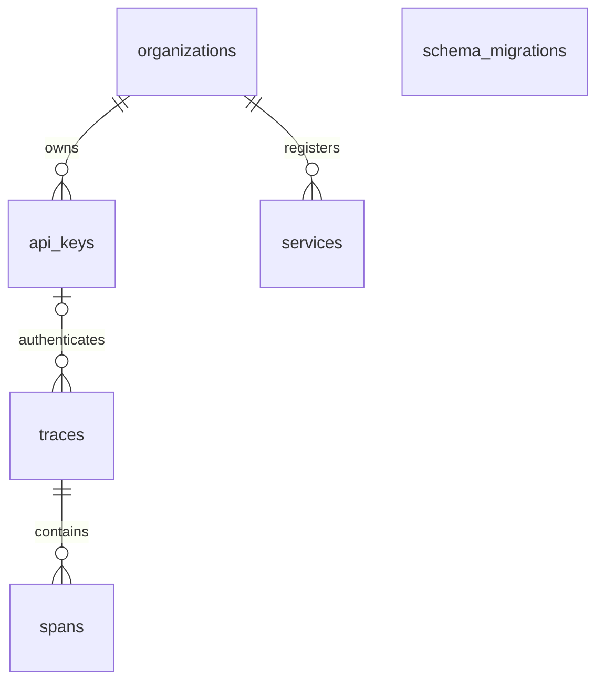
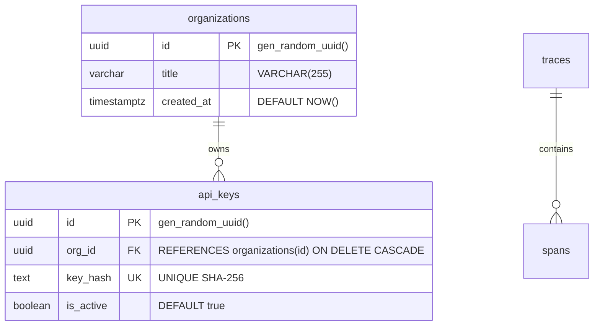

# arch-db-diagram-init

Initialize and generate database Entity-Relationship (ER) architecture diagrams using Mermaid. This skill inspects existing database migrations, DDL scripts, or ORM models and creates a standardized, modular documentation suite under `architecture/db-diagrams/` (or the folder defined by `DB_DESTINATION`).

It prevents information overload by separating the high-level structural topology from the exhaustive column-level specifications, while enforcing a **single source of truth** through dedicated `.mmd` source files.

---

## Configuration & Arguments

| Parameter | Description | Lookup / Default |
|:---|:---|:---|
| **Destination Folder** | Directory where database diagrams and overview documentation are stored. | Look up parameter `DB_DESTINATION` in the root `.env.dev` file first. If the entry does not exist, ask the user for the destination. |
| **Project Title** | Name of the software system or service whose database is being modeled. | System title (e.g., `"Rudder Trim"`). |
| **Database Engine** | RDBMS engine and host details (PostgreSQL, Neon, MySQL, SQLite, etc.). | Discovered from connection config or migrations (e.g. `"Neon Serverless PostgreSQL"`). |
| **Schema Source** | Path to DDL migrations, SQL scripts, or ORM model definitions. | Auto-detected (e.g., `backend/sql/`, `migrations/`, `alembic/`, `prisma/schema.prisma`). |

---

## Output Architecture & File Structure

When initialized, the destination directory (e.g. `architecture/db-diagrams/`) must follow this canonical layout:

```text
{DB_DESTINATION}/
├── complete_er_tables_only.mmd       # Canonical: High-level table topology without column attributes
├── complete_er_full_detail.mmd       # Canonical: Full schema with all columns, types, keys & constraints
├── {domain_1}.mmd                    # Canonical: Domain-focused ER diagram (e.g., multi_tenancy.mmd)
├── {domain_2}.mmd                    # Canonical: Domain-focused ER diagram (e.g., observability_telemetry.mmd)
├── {domain_n}.mmd                    # Canonical: Domain-focused ER diagram (e.g., semantic_clustering.mmd)
├── schema_migrations.mmd             # Canonical: Ledger/migration tracking table
└── overview.md                       # Main documentation hub referencing each .mmd source
```

> [!IMPORTANT]
> **Single Source of Truth Rule:**
> - The overview documentation file MUST be named **`overview.md`** (do NOT use `README.md`).
> - Every diagram MUST be written to its own canonical `.mmd` file.
> - Do NOT create redundant files like a separate `schema.mmd` if `complete_er_full_detail.mmd` already exists.
> - `overview.md` links to the canonical `.mmd` files and embeds their rendered Mermaid code blocks for immediate preview.

---

## Step-by-Step Instructions

### Step 1: Resolve Destination Folder & Confirm Inputs

1. **Destination Folder Lookup**:
   - Check the root `.env.dev` file for the parameter `DB_DESTINATION` (e.g., `DB_DESTINATION=architecture/db-diagrams/`).
   - If `DB_DESTINATION` exists in `.env.dev`, use its value as the destination folder.
   - If the entry does not exist in `.env.dev` (or `.env.dev` file is missing), **ask the user** for the destination folder (suggesting `architecture/db-diagrams/` as the recommended default).
2. **Ensure Directory Exists**: Confirm the destination path and ensure the target directory exists before writing files.

---

### Step 2: Audit Schema & Discover Tables

Conduct a read-only audit of the codebase to reconstruct the exact live database schema:

1. **Static Migration Inspection:**
   - Scan the migration directory (e.g., `backend/sql/`, `migrations/`, `prisma/`).
   - Read all migration files sequentially (`001_*.sql`, `002_*.sql`, etc.) to trace column additions, renames, drops, and foreign key modifications.
2. **ORM / Model Verification:**
   - Cross-reference Pydantic, SQLAlchemy, SQLModel, or Prisma models to confirm active application types and fields.
3. **Inventory Compilation:**
   Extract for every table:
   - Table name
   - Columns and SQL data types
   - Primary Keys (`PK`)
   - Foreign Keys (`FK`) and target references (`REFERENCES target_table(id)`)
   - Cascading actions (`ON DELETE CASCADE`, `ON DELETE SET NULL`, `ON DELETE RESTRICT`)
   - Unique constraints (`UK`)
   - Specialized column types (e.g., `vector(1536)`, `jsonb`, `uuid`)
   - Specialized indexes (e.g., `GIN`, `HNSW`, `BTREE`, partial indexes)

---

### Step 3: Domain Partitioning & Alignment (Invoke `fn-domain-discovery`)

To avoid overwhelming readers with a single massive diagram, invoke the companion skill **[`fn-domain-discovery`](../fn-domain-discovery/SKILL.md)** to partition the discovered tables into 3 to 6 logical functional domains.

The discovery process synthesizes:
1. **Schema Topology & Foreign Key Clusters:** (Tables bound by `ON DELETE CASCADE` or deep nesting belong together).
2. **Chronological Migration Intent & Epics:** (Tracing migration history to identify feature groupings).
3. **Application Code Outlines via `cocoindex-code` (`ccc`):**
   - Run `ccc search` to inspect API router groupings, service class methods, query joins, and Pydantic/ORM models to verify how the live application accesses the tables.
4. **Domain-Driven Bounded Contexts:** Grouping tables by business capability (e.g., Identity & Auth, Telemetry Ingestion, Vector Embeddings/Clustering, Candidate Curation, Migration Operations).
5. **Cognitive Load Optimization (Miller's Law):** 3–6 domains per system, 2–6 tables per domain.
6. **Confirm with User:** Present the proposed domain breakdown for user confirmation before proceeding to file generation.

---

### Step 4: Generate Canonical Mermaid Source Files (`.mmd`)

Write each diagram into its dedicated `.mmd` file in `{DB_DESTINATION}/`.

#### 4.1 `complete_er_tables_only.mmd`
Renders only table entities and relationships without any field attributes:

*Note:* Isolated tables without foreign key relationships MUST use empty braces `entity_name {}` so they render properly in Mermaid.

#### 4.2 Modular Domain Diagrams (`{domain}.mmd`)
Generate focused diagrams for each domain:
- `multi_tenancy.mmd`
- `observability_telemetry.mmd`
- `semantic_clustering.mmd`
- `candidate_selection.mmd`
- `schema_migrations.mmd`

#### 4.3 `complete_er_full_detail.mmd`
Contains all tables, relationships, column names, data types, keys, and constraint comments:


---

### Step 5: Generate `overview.md`

Create `{DB_DESTINATION}/overview.md` containing:

1. **Title & High-Level Database Overview:**
   - Host / Engine details (e.g., Neon Serverless, AWS RDS PostgreSQL 16+).
   - Extensions used (e.g., `vector`, `uuid-ossp`).
   - Role separation & security model (migrator vs. runtime roles).
   - Connection pooling and timezone policy (`TIMESTAMPTZ` UTC).
2. **Complete ER Diagram - Tables Only:**
   - Link: `> 📄 **Canonical Diagram Source**: [complete_er_tables_only.mmd](...)`
   - Rendered Mermaid block of tables and relationships.
3. **Domain-Specific Architecture Diagrams:**
   - For each domain:
     - Link to canonical `.mmd` file.
     - Short description of the domain's responsibility.
     - Rendered Mermaid block.
4. **Data Dictionary & Constraints Table:**
   - Markdown table with: `Table Name`, `Primary Key`, `Foreign Key References`, `Cascading Action`, `Unique Constraints`.
5. **Key Indexes & Query Optimizations Table:**
   - Markdown table with: `Index Name`, `Table`, `Type` (BTREE, GIN, HNSW), `Target Column(s)`, `Purpose`.
6. **Complete ER Diagram - Full Detail:**
   - Placed at the bottom for in-depth inspection without overwhelming the reader upfront.
   - Link: `> 📄 **Canonical Diagram Source**: [complete_er_full_detail.mmd](...)`
   - Rendered Mermaid block with full attributes.
7. **Related Code & Resources:**
   - Clickable markdown links (`file:///...`) to migrations, models, and runbooks.

---

### Step 6: Mermaid Syntax Guidelines & Trap Avoidance

When generating Mermaid `erDiagram` syntax, follow these strict rules to prevent rendering crashes:

1. **No Parentheses in Types:**
   - ❌ `varchar(255) title`
   - ❌ `vector(1536) embedding`
   - ✅ `varchar title "VARCHAR(255)"`
   - ✅ `vector embedding "vector(1536) HNSW indexed"`
   - ✅ `timestamptz created_at "DEFAULT NOW()"`
2. **Valid Key Specifiers:**
   - Allowed key tags: `PK` (Primary Key), `FK` (Foreign Key), `UK` (Unique Key).
   - Compound keys: `PK,FK`.
3. **Quote All Comments & Labels:**
   - Always put comments and relationship labels in double quotes `"..."`.
   - ❌ `organizations ||--o{ api_keys : owns`
   - ✅ `organizations ||--o{ api_keys : "owns"`
4. **Correct Cardinality Operators:**
   - `||--o{` : exactly one to zero or more
   - `||--|{` : exactly one to one or more
   - `|o--o{` : zero or one to zero or more
   - `||--||` : exactly one to exactly one
   - `|o--||` : zero or one to exactly one
5. **Standalone Entities:**
   - Tables with no relationships must specify `{}`:
     ```mermaid
     schema_migrations {
     }
     ```

---

### Step 7: Final Cleanup & Index Refresh

1. **Remove Obsolete Files:** If a previous `README.md` or redundant `schema.mmd` exists in `{DB_DESTINATION}/`, delete them to maintain the single-source-of-truth structure.
2. **Update Workspace Index:** Run `ccc index` to keep the codebase semantic search index fresh.
